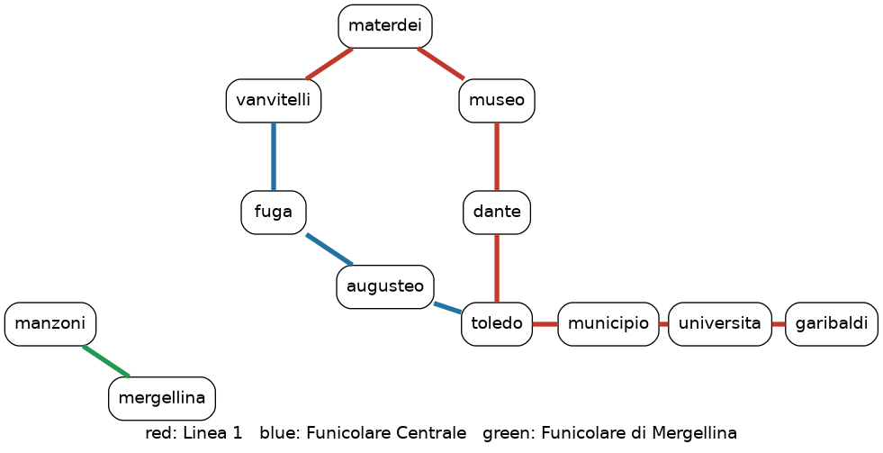

# Programming test

After the robo-pizzeria, Ciro Musk wants to give Naples a metro that is as good as London's, where you pay with a card and only for what you ride.

It works like this. Every passenger has a card. To enter a station you touch the gate with the card: this is a **tap in**. To leave the metro, at the station where you get off, you touch the gate again: this is a **tap out**. A **trip** is a tap in followed by the tap out of the same card, and the card pays for it at the tap out.

Your job is the program behind the gates. It receives the events of one day, one per line, and answers each of them.

For example, if this is the standard input:

```
TAPIN ciro garibaldi
TAPIN gennaro dante
TAPOUT ciro toledo
PENDING
FARE ciro
```

then this is the expected standard output, one line for each line of the input:

```
OK
OK
2
gennaro
2
```

Ciro enters at garibaldi, gennaro enters at dante. Ciro gets off at toledo and pays 2. Only gennaro is still travelling. Ciro paid 2 today.

## Tips

- Read the whole statement before writing code.
- Start from the main loop: read a line, print a line. Then add one command at a time.
- There are test cases for each command, in the order of the statement: make one pass before moving to the next.
- Run `lint.py` and `check.py` often, not only at the end.
- Commit often: every time a new test passes is a good moment.

## Rules of the program

Your program reads standard input, one command per line, and answers each command with exactly one line on standard output. Any programming language is fine.

### How to read this statement

Every command is described the same way: what it prints when it succeeds, and the errors it can print instead. The examples show a command and, after `->`, the line your program must print for it (do not print the `->`).

- A card is **inside** the metro from a successful `TAPIN` until its next successful `TAPOUT`.
- A command that prints an error changes nothing: it is as if the line was never there.
- A **list** is printed on one single line, items separated by one space. An empty list prints `none`.

### The stations

A valid "station" is one of the following lowercase strings: `garibaldi` `universita` `municipio` `toledo` `dante` `museo` `materdei` `vanvitelli` `augusteo` `fuga` `mergellina` `manzoni`

### Errors common to all commands

Card ids are single words: any word is a valid card. Commands are uppercase.

| when | prints |
|------|--------|
| unknown command, or wrong number of arguments | `ERROR invalid command` |
| a station that is not one of the above | `ERROR unknown station` |
| empty line | nothing, not even an empty line |

A wrong command prints one error, on one line. If more than one error applies, print any one of them: in the test cases a command never has more than one error.

```
TAPIN ciro                -> ERROR invalid command
tapin ciro toledo         -> ERROR invalid command
TAPIN ciro posillipo      -> ERROR unknown station
```

The program never crashes.

### Output

- ASCII only. Numbers without sign or leading zeros.
- Nothing else on standard output: no user input prompts, no debug messages. Standard error is ignored.
- Blank lines and extra spaces are ignored. Everything else must match exactly.

### Running and checking

`test-cases/<id>.in` are the inputs, `solutions/<id>.out` the expected outputs. Your program must not open files: run it with shell redirection, then check the output (any Python):

```
python3 metro.py < test-cases/01-tapin.in > test-cases/01-tapin.out
python3 lint.py test-cases/01-tapin.out
python3 check.py test-cases/01-tapin.in test-cases/01-tapin.out solutions/01-tapin.out
```

Replace the first line with however your program runs: `./metro`, `java Metro`, ...

`lint.py` prints `Y`, or `N` and the first format problem: `Y` does not mean your output is correct. `check.py` prints `PASS`, or `FAIL` and the first wrong answer, with the line of the input file and the command it answers:

```
FAIL line 7 'TAPOUT ciro toledo': expected '2', got '1'
```

Work through the test cases in the order of their number. Each test adds one thing to the previous ones, so the first test that fails tells you which command to look at. Your program will be graded the same way, on these test cases and on others you have not seen.

## First part: taps, fares, regulars

### Taps and fares

| command | meaning | prints | errors of the command |
|---------|---------|--------|-----------------------|
| `TAPIN <card> <station>` | the card enters the metro at the station | `OK`, the card is now inside | `ERROR already in` if the card is inside |
| `TAPOUT <card> <station>` | the card leaves the metro at the station: its trip ends | the price of the trip that just ended, the card is no longer inside | `ERROR not in` if the card is not inside |
| `PENDING` | who is travelling right now? | the list of the cards inside, in alphabetical order | |
| `FARE <card>` | how much did the card pay today? | the sum of the prices printed by the `TAPOUT`s of the card, `0` for a card never seen | |

The price of a trip depends only on how many trips that card has completed today, this one included. Each card has its own count. Stations do not matter: a trip that starts and ends at the same station counts like any other.

| trip of the card | 1st | 2nd | 3rd | 4th | 5th | 6th and later |
|------------------|-----|-----|-----|-----|-----|---------------|
| price            | 2   | 2   | 2   | 1   | 1   | 0             |

```
PENDING                 -> none
TAPIN gennaro dante     -> OK
TAPIN ciro garibaldi    -> OK
TAPIN ciro toledo       -> ERROR already in
PENDING                 -> ciro gennaro
TAPOUT ciro toledo      -> 2
TAPOUT ciro toledo      -> ERROR not in
PENDING                 -> gennaro
FARE ciro               -> 2
FARE gennaro            -> 0
```

Read it as a story: gennaro enters at dante, ciro enters at garibaldi. Ciro cannot enter again while he is inside. Ciro gets off at toledo and pays 2 for his first trip; he cannot get off twice. Gennaro is still travelling, and has paid nothing yet.

### Regulars of a station

| command | meaning | prints | errors of the command |
|---------|---------|--------|-----------------------|
| `REGULARS <station>` | who uses this station the most? | the list of `<card>:<count>` for every card that tapped at the station | |

The count of a card is the number of its successful `TAPIN`s plus its successful `TAPOUT`s at that station. Taps that printed an error do not count. The list is sorted by count, largest first; cards with the same count go in alphabetical order.

```
REGULARS toledo         -> none
TAPIN gennaro toledo    -> OK
TAPIN ciro toledo       -> OK
REGULARS toledo         -> ciro:1 gennaro:1
TAPOUT gennaro toledo   -> 2
REGULARS toledo         -> gennaro:2 ciro:1
```

### Test cases of the first part

| test | commands |
|------|----------|
| `01-tapin` | `TAPIN` |
| `02-tapout` | + `TAPOUT` |
| `03-pending` | + `PENDING` |
| `04-fare` | + `FARE` |
| `05-errors` | all of the above, with wrong commands |
| `06-oyster` | all of the above |
| `07-regulars-count` | + `REGULARS` |
| `08-regulars-order` | `REGULARS` |
| `09-regulars` | all of the above |

## Open questions

Answer in a few lines each, in a file `answers.txt` next to your program. No code needed, but talk about your own program, not about programs in general. You can answer them even if you do not do the second part.

**Q1.** Assume you need to support a new command in your program. What would you have to change in your implementation? Is there any way you could avoid changing too much code?

**Q2.** Ticket prices and pricing policies may change during the year, even beyond a simple change of the price table. For example, there could be complex features such as birthday discounts or time-dependent fares. How would you make sure that pricing policies do not affect too much of your code?

**Q3.** You want to get a rough idea of what is expensive (time) in your implementation. How would you do it?

**Q4.** The error messages must be translated to Italian and Neapolitan. In how many places do you have to change your code? How would you bring that number down?

## Second part (bonus): the network

Do it only after the first part passes all its tests. It only adds commands: everything above stays as it is, rules included.



Each station is joined by a track to the next one on its line. Tracks go both ways: `toledo dante` and `dante toledo` name the same track.

- Linea 1: `garibaldi` `universita` `municipio` `toledo` `dante` `museo` `materdei` `vanvitelli`
- Funicolare Centrale: `toledo` `augusteo` `fuga` `vanvitelli`
- Funicolare di Mergellina: `mergellina` `manzoni`

During the day a track can be closed (a breakdown, a strike) and opened again. At the start of the day every track is open.

| command | meaning | prints | errors of the command |
|---------|---------|--------|-----------------------|
| `CLOSED <a> <b>` | the track between `a` and `b` closes | `OK` | `ERROR no track` if no track joins `a` and `b`, else `ERROR already closed` |
| `OPEN <a> <b>` | the track between `a` and `b` opens again | `OK` | `ERROR no track` if no track joins `a` and `b`, else `ERROR not closed` |
| `REACHABLE <a> <b>` | can I go from `a` to `b`? | `YES` if you can go from `a` to `b` using only open tracks, `NO` otherwise | |
| `ROUTE <a> <b>` | which way do I go from `a` to `b`? | the list of the stations of the shortest trip from `a` to `b` on open tracks, from `a` to `b`, both included; `UNREACHABLE` if there is none | |

A station always reaches itself: `REACHABLE toledo toledo` prints `YES`, `ROUTE toledo toledo` prints `toledo`. If multiple shortest trips exist, any of them is ok as an answer.

```
REACHABLE garibaldi toledo       -> YES
REACHABLE garibaldi mergellina   -> NO
ROUTE toledo vanvitelli          -> toledo augusteo fuga vanvitelli
ROUTE garibaldi manzoni          -> UNREACHABLE
CLOSED garibaldi toledo          -> ERROR no track
CLOSED municipio toledo          -> OK
CLOSED toledo municipio          -> ERROR already closed
REACHABLE garibaldi toledo       -> NO
OPEN toledo municipio            -> OK
OPEN toledo municipio            -> ERROR not closed
REACHABLE garibaldi toledo       -> YES
```

### Test cases of the second part

| test | commands |
|------|----------|
| `10-tracks` | `CLOSED` `OPEN` |
| `11-reachable` | `REACHABLE` |
| `12-reachable-closed` | + `CLOSED` `OPEN` |
| `13-closures` | all of the above |
| `14-route` | `ROUTE` |
| `15-route-closed` | + `CLOSED` `OPEN` |
